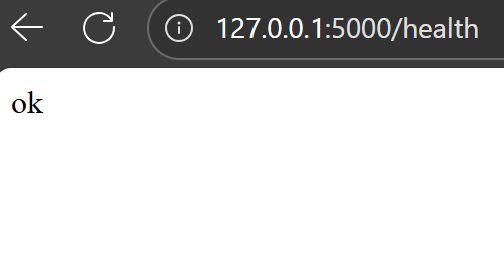
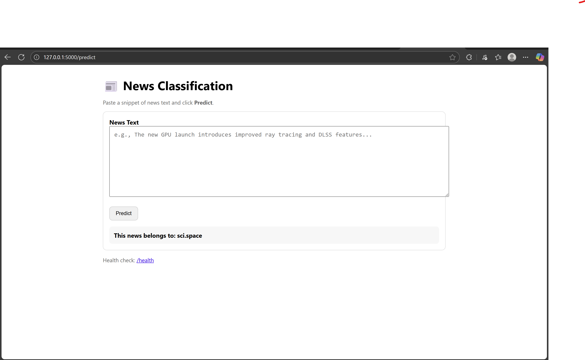

# 📰 Dockerized News Classification App (MLOps Lab)

This project demonstrates a simple **ML model + Flask API + Docker** pipeline for real-time text classification using the [20 Newsgroups dataset](https://scikit-learn.org/stable/datasets/real_world.html#the-20-newsgroups-text-dataset).  

The model predicts the **category of a news text snippet**, containerized using Docker for easy deployment.

---

## 📸 Project Screenshots

### ✅ Health Check Endpoint
The `/health` endpoint returns a simple status to confirm the API is running.


### 🧠 Prediction UI
The `/predict` page allows you to enter any text and get the predicted news category.


---

## 🧰 Tech Stack

- **Python 3.11**
- **Flask** — lightweight web server
- **Scikit-learn** — for training a text classification model
- **Docker** — for containerization
- **HTML + Bootstrap** — for the simple frontend

---

## 🧪 How It Works

1. Uses the `fetch_20newsgroups` dataset from `sklearn.datasets` as a built-in dataset.  
2. Trains a **TF-IDF + Naive Bayes** model to classify news into categories (e.g., `sci.space`, `rec.autos`, `talk.politics.misc`, etc.).
3. Saves the model (`news_model.pkl`) and category labels (`target_names.pkl`).
4. A Flask server loads the model and provides:
   - `/health` — health check
   - `/predict` — web UI for predictions
   - `/predict_json` — JSON API (optional)
5. Dockerfile builds the image and serves the app on port 5000.

---

## 🐳 Running Locally with Docker

```bash
# 1. Build the Docker image
docker build -t news-ml-flask .

# 2. Run the container
docker run --rm -p 5000:5000 news-ml-flask

# Test the Prediction Endpoint
curl -X POST -F "news_text=NASA announces new mission to Mars" http://127.0.0.1:5000/predict

# Project Structure
.
├── Dockerfile
├── requirements.txt
├── templates/
│   └── index.html
├── src/
│   ├── main.py
│   ├── model_training.py
│   └── utils.py
├── news_model.pkl
├── target_names.pkl
└── README.md

# Endpoints
🧭 Endpoints
Endpoint	Method	Description
/health	GET	Returns ok
/predict	GET/POST	Web UI for text prediction
/predict_json	POST	Returns JSON with predicted class


✅ **How to use:**  
1. Save this content as `README.md` in the root of your repo.  
2. Make sure your two image files are named:
   - `news_health.png`
   - `news_predict.png`  
   (and are placed in the root of the repo as well or in an `/images` folder with updated paths in the markdown)

3. Commit and push:
```powershell
git add README.md news_health.png news_predict.png
git commit -m "Add README with project description and screenshots"
git push
```
# How My Lab is Different from Professor
| **Aspect**        | **Professor’s Lab**            | **Your Lab**                                     |
| ----------------- | ------------------------------ | ------------------------------------------------ |
| **Task**          | Iris Dataset classification    | News topic classification                        |
| **Dataset**       | Local CSV                      | Built-in `fetch_20newsgroups` (no file needed)   |
| **Model**         | Pre-trained Keras model        | TF-IDF + trained during Docker build |
| **Endpoints**     | `/` and `/predict`             | `/predict` + `/health` (health check)            |
| **UI**            | Basic HTML                     | Bootstrap-styled prediction page                 |
| **Docker Build**  | Uses saved model               | Trains model inside container                    |
| **MLOps Add-ons** | No health check                | Health check + testable with `curl`              |

✨ Author

👩‍💻 Samruddhi Bansod
📍 Northeastern University — MLOps Lab

